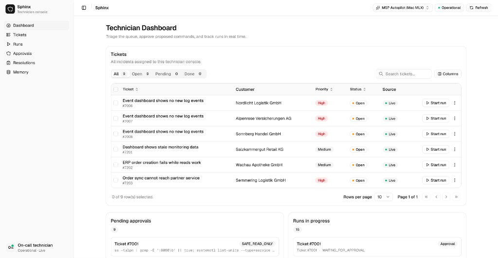
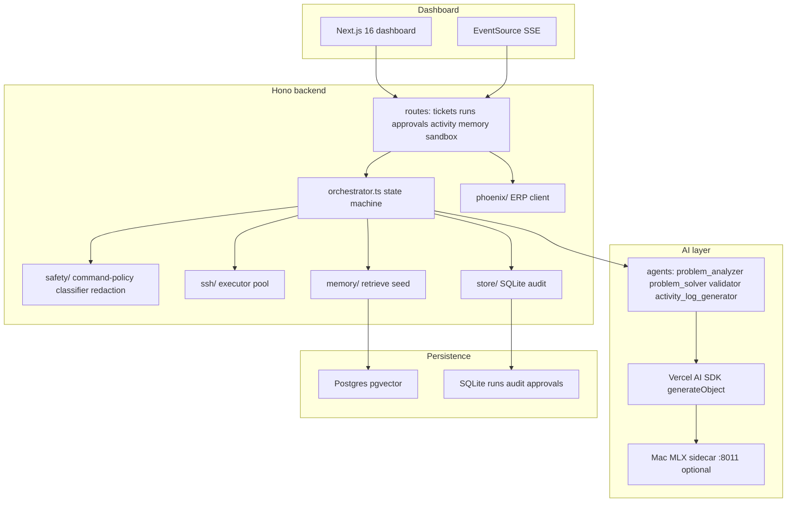
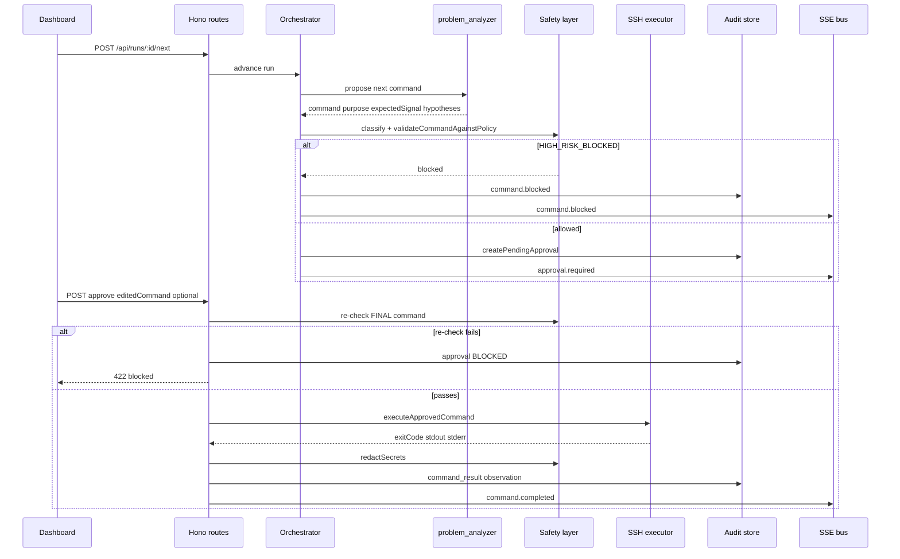
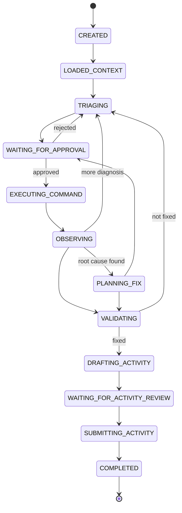
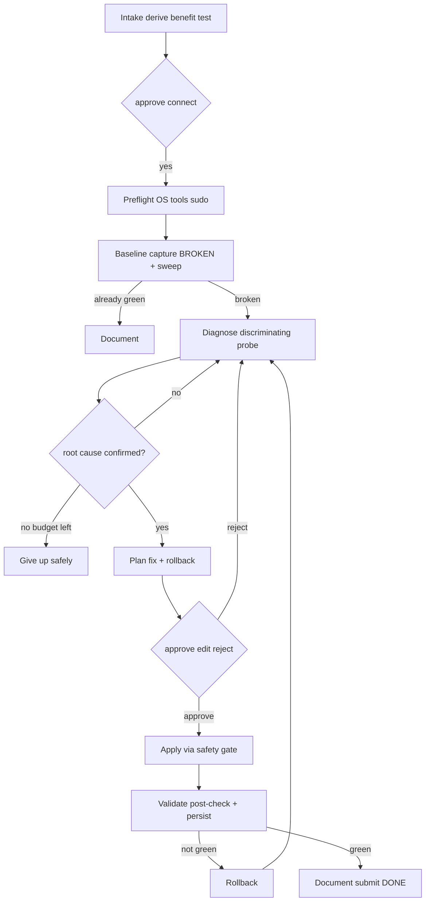

<h1 align="center">Sphinx</h1>

<p align="center">
  <strong>Technician-controlled AI troubleshooting for MSP service desks: the model proposes, the human approves, the backend executes after deterministic safety checks</strong>
</p>

<p align="center">
  
</p>

<p align="center">
  <a href="https://github.com/START-Vienna/techbold_track_template"></a>
  
  
  
  
  
</p>

## Run with Docker

Requires [Docker Desktop](https://www.docker.com/products/docker-desktop/) (or Docker Engine with the Compose plugin).

```bash
git clone https://github.com/START-Vienna/techbold_track_template.git
cd techbold_track_template
cp .env.example .env          # mock mode by default; no API keys required
docker compose up --build     # builds and starts db + backend + frontend
```

When containers are healthy, open the dashboard:

| Service | URL |
| ------- | --- |
| **Dashboard** | http://localhost:3000 |
| **Backend API** | http://localhost:8000 |
| **Health** | http://localhost:8000/health |
| **Postgres** | `localhost:5432` (`autopilot` / `autopilot`) |

Stop the stack: `docker compose down`. Drop volumes too: `docker compose down -v`.

**Optional profiles** (same repo, same Compose file):

```bash
docker compose --profile sandbox up sandbox   # 5 fake-VM incidents (SSH :2201-2205)
docker compose --profile py up backend-py     # secondary FastAPI backend on :8002
```

After seeding sandbox VMs, set `MOCK_SCENARIOS=true` in `.env` and restart the backend container so tickets start at `7101`.

**Convenience wrapper** (auto-creates `.env`, generates sandbox SSH keys, health-waits, prints mode):

```bash
bun run start              # same core stack as docker compose up --build
bun run start -- --sandbox # core stack + sandbox seed
bun run stop               # docker compose down
```

`.env.example` ships with `MOCK_MODE=true` so the full technician workflow runs offline with no Phoenix token, SSH target, or LLM key.

<!-- Capture assets: bun run start -> http://localhost:3000
     - docs/assets/dashboard-home.png   /dashboard home (tickets + approvals)
     - docs/assets/run-approval.png     run view with Confirmation approval card
     - docs/assets/memory-map.png       /dashboard/memory vector map
     - docs/assets/demo.gif             screen recording: ticket -> run -> approve -> submit -->

## Overview

Sphinx is a technician-controlled troubleshooting copilot for the **techbold START Hack Vienna** track. The Hono backend loads service-desk tickets from Phoenix ERP, runs a **deterministic incident-run state machine**, and invokes specialist AI agents that propose **one diagnostic or fix command at a time**. Every command passes a **deterministic safety gate** (blocklist + risk classification), waits for **explicit human approval** (approve, edit-then-approve, or reject), and only then executes over SSH in backend code. Results are redacted, appended to an **immutable audit log**, fed back as observations, validated for persistence, and finally distilled into a **five-field ERP activity** the technician reviews and submits.

**The AI never executes on its own.** The model has no registered execute tool; `ssh/executor.ts` runs only after a human decision and a second safety re-check on the final command string.

## The challenge

MSP technicians need AI that helps under pressure without becoming a liability. Static runbooks miss context; unconstrained agents propose destructive commands, leak secrets, or invent fixes they never verified. Rubric **B (35 pts)** and **C (20 pts)** together are **55 of 100 points** - and hard-fail patterns zero an incident.

Sphinx targets the gap between **detection and safe remediation**: one path from Phoenix ticket -> stored audit -> human-readable run timeline -> validated fix -> ERP activity, with defence-in-depth safety at every layer.

## Core capabilities

| Track | What ships |
| ----- | ---------- |
| **A - Functional MVP & ERP (20 pts)** | Phoenix ticket list with sort/filter, customer-system metadata, full run lifecycle, five-field activity create + submit, graceful 401/404/empty states |
| **B - Troubleshooting (35 pts)** | Diagnosis-first ranked hypotheses, ground-truth enrichment sweep, minimal reversible fixes, persistence validation, activity grounded in audit facts only |
| **C - Safety & audit (20 pts)** | Append-only audit trail, regex blocklist + risk tiers, secret redaction before log/UI/model, human gate on every command (including manual and undo paths) |
| **D - Technician UX (10 pts)** | Next.js dashboard: ticket triage, live SSE run feed, inline approval cards with edit/reject, resolution editor, abort/retry |
| **E - Engineering (15 pts)** | Bun monorepo, modular backend (`phoenix/`, `ssh/`, `safety/`, `ai/`, `store/`), Vitest suite, Docker one-command start, `.env.example`, this README |
| **Model sidecar (bonus)** | Optional Mac MLX LoRA adapter (`techbold/msp-autopilot`) trained on sandbox-derived synthetic data, served OpenAI-compatible on `:8011` |
| **Sandbox (dev + training)** | Five Docker fake-VM incident archetypes (systemd Ubuntu, SSH 2201-2205) as local dev harness and model dataset source |

## Demo walkthrough

<p align="center">
  
</p>

What you see in the dashboard ([`apps/dashboard`](apps/dashboard)):

1. **Tickets** - queue with status/priority filters; start a run from any open ticket.
2. **Run view** - SSE live feed: agent tasks, reasoning, ranked hypotheses, proposed commands (`Tool` cards).
3. **Approve** - inline `Confirmation` card: approve, edit command, or reject with reason; safety re-checks edits.
4. **Validate** - agent re-runs the customer-benefit test and persistence checks; timeline shows redacted stdout.
5. **Submit** - review the five-field activity draft (`summary`, `root_cause`, `actions_taken`, `commands_summary`, `validation_result`) and POST to Phoenix.

Deep views (direct URL): [`/dashboard/audit`](http://localhost:3000/dashboard/audit), [`/dashboard/memory`](http://localhost:3000/dashboard/memory), [`/dashboard/observability`](http://localhost:3000/dashboard/observability).

---

## Implementation: how it actually works

### System architecture



The browser talks only to the Hono API. Phoenix tokens, SSH keys, and LLM credentials stay server-side.

### End-to-end request flow (one approved command)



**Invariant:** the safety gate runs **twice** - at proposal and after any human edit. Execution lives in `ssh/executor.ts`, never inside an AI tool.

### Incident-run state machine



Phoenix only ever sees `OPEN` / `PENDING` / `DONE`. Rich internal phases stay in the backend store.

### Agent pipeline (phases 0-8)

| Phase | Goal | Human touchpoint |
| ----- | ---- | ---------------- |
| 0 Intake | Parse ticket, derive customer-benefit test | Approve VM connect |
| 1 Preflight | OS, tools, `sudo -n` capability | Approve read-only batch |
| 2 Baseline | Capture failing benefit test + ground-truth sweep | Approve read-only batch |
| 3 Diagnose | Ranked hypotheses, most-discriminating probe | Approve each probe |
| 4 Plan fix | Minimal reversible change + rollback | - |
| 5 Apply | Execute gated fix | Approve / edit / reject |
| 6 Validate | Post-check + persistence + no-regression | Approve validation probes |
| 7 Document | Five-field activity from audit only | Review / edit / submit |
| 8 Give-up-safely | Rollback partials, honest partial activity | Informed abort |

**Unknown errors:** when no runbook matches, the agent runs a batched ground-truth sweep (failed units, journal errors, listeners, resources, what-changed), localizes the failing layer, follows the system's error channels inward, and hypothesizes only from observed evidence. Full method: [`docs/AGENT_PIPELINE.md`](docs/AGENT_PIPELINE.md).



### Specialist agents

Agent filenames mirror the brief's vocabulary. All use AI SDK structured output (`generateObject` + Zod); none can execute SSH.

| Agent | Role | Definition |
| ----- | ---- | ---------- |
| `problem_analyzer` | Ranked hypotheses + one diagnostic command | [`apps/backend/src/ai/agents/problem-analyzer.ts`](apps/backend/src/ai/agents/problem-analyzer.ts) |
| `customer_system_analyzer` | System context summary from read-only probes | [`apps/backend/src/ai/agents/customer-system-analyzer.ts`](apps/backend/src/ai/agents/customer-system-analyzer.ts) *(defined + tested; not on main orchestrator path)* |
| `problem_solver` | Minimal reversible fix + rollback | [`apps/backend/src/ai/agents/problem-solver.ts`](apps/backend/src/ai/agents/problem-solver.ts) |
| `validator` | `VERIFIED_FIXED` / `LIKELY_FIXED` / `NOT_FIXED` | [`apps/backend/src/ai/agents/validator.ts`](apps/backend/src/ai/agents/validator.ts) |
| `activity_log_generator` | Five ERP fields from audit trail only | [`apps/backend/src/ai/agents/activity-log-generator.ts`](apps/backend/src/ai/agents/activity-log-generator.ts) |

Orchestrator driver: [`apps/backend/src/ai/orchestrator.ts`](apps/backend/src/ai/orchestrator.ts). Observe guard (systemd exit 4 disproves unit hypotheses): [`apps/backend/src/ai/observe-guard.ts`](apps/backend/src/ai/observe-guard.ts).

### Safety gate (defence in depth)

Implemented in [`apps/backend/src/safety/`](apps/backend/src/safety/). Full policy: [`docs/SAFETY_POLICY.md`](docs/SAFETY_POLICY.md).

1. **At proposal** - `validateCommandAgainstPolicy` blocks `HIGH_RISK_BLOCKED` before approval.
2. **At approval** - full re-check on the possibly edited final command.
3. **At execution** - non-interactive single command, connect + command timeout, output cap, `bash -lc` wrapping.
4. **At logging** - `redactSecrets` on every string before audit, UI, or model context.
5. **In prompts** - model instructed never to propose forbidden patterns (advisory; policy is authoritative).

Blocklist categories: recursive deletes, disk format, mass chmod/chown, security disable, secret dumps, log/history erasure, exfiltration, DB destruction, privilege escalation workarounds.

### Memory and continual learning

[`apps/backend/src/memory/`](apps/backend/src/memory/) stores redacted solution embeddings in **Postgres + pgvector** (hash fallback when no DB or Gemini key). Seed corpus: public incidents, encoded runbooks, sandbox training contracts. Placeholder sanitization prevents generic runbook names from becoming live targets ([`sanitize-placeholders.ts`](apps/backend/src/memory/sanitize-placeholders.ts)). Dashboard vector map: `/dashboard/memory`.

### Trained model sidecar (optional)

| Item | Value |
| ---- | ----- |
| Dashboard model id | `techbold/msp-autopilot` |
| Served MLX base | `mlx-community/Qwen2.5-1.5B-Instruct-4bit` |
| OpenAI-compatible URL | `http://127.0.0.1:8011/v1` |

Train + serve on Apple Silicon: [`apps/model/README.md`](apps/model/README.md). Dataset: 5 sandbox archetypes + 240 deterministic synthetic rows from [`infra/sandbox/scenarios/training-contracts.json`](infra/sandbox/scenarios/training-contracts.json). The model proposes; the backend owns safety, approval, execution, and audit.

### Sandbox incident harness

Five Docker fake VMs (systemd Ubuntu + SSH) for local dev and model training. Details: [`infra/sandbox/README.md`](infra/sandbox/README.md).

| Archetype | Ticket | SSH port | Symptom |
| --------- | ------ | -------- | ------- |
| service-health | 7101 | 2201 | Status endpoint down after restart |
| document-upload | 7102 | 2202 | Document upload server error |
| partner-sync | 7103 | 2203 | Order sync cannot reach partner |
| erp-write-path | 7104 | 2204 | ERP order creation fails, reads work |
| monitoring-data | 7105 | 2205 | Dashboard shows stale monitoring data |

---

## Technology stack

| Layer | Choices |
| ----- | ------- |
| Backend | Node 22, Hono 4, TypeScript, Vercel AI SDK, ssh2, better-sqlite3, pg + pgvector, Zod |
| Frontend | Next.js 16, React 19, Tailwind CSS v4, shadcn/ui, custom ai-elements, TanStack Table, Recharts |
| Contracts | `@techbold/contracts` - shared API + safety types |
| Model | Python MLX sidecar (`apps/model`), optional CUDA/vLLM path |
| Infra | Docker Compose (db + backend + frontend + sandbox profile), Bun workspaces |
| Quality | Biome, Vitest, Husky lint-staged, Ruff (Python) |

Secondary backend: [`apps/backend-py`](apps/backend-py) - FastAPI autograde engine with selective HITL (`auto_run_readonly`); **not** the shipped default.

---

## Reliability and safety

- **Offline by default** - `.env.example` sets `MOCK_MODE=true`; fresh clone runs full flow with no credentials.
- **Append-only audit** - never deleted; activity writer reads audit only (no invented actions).
- **Secret posture** - keys in env / mounted `/keys`; redaction on all outputs; `.env` git-ignored.
- **Timeouts and retries** - Phoenix fetch (AbortController + bounded 5xx retry), SSH connect/command caps, agent 30s timeout + one retry.
- **SSH hardening** - `bash -lc` for login PATH, `sudo -n` (no TTY hang), exit code as truth.
- **Mock fallbacks** - per-service `MOCK_PHOENIX`, `MOCK_SSH`, `MOCK_LLM` override `MOCK_MODE`.
- **Max-step guard** - orchestrator caps commands per run; honest partial activity on exhaustion.

---

## Prerequisites

- **Node 22+** and [Bun](https://bun.sh) (`>=1.1`)
- **Docker** with Compose plugin (for `bun run start`)
- **Apple Silicon Mac** (optional, for MLX train/serve)

---

## Quick start (one command)

```bash
bun run start
```

Brings up the entire stack: auto-creates `.env` from `.env.example`, generates sandbox SSH keypair if missing, builds and starts `db` + `backend` + `frontend` (detached), waits for health checks, prints URLs and resolved mock/live mode.

| URL | Purpose |
| --- | ------- |
| http://localhost:3000 | Dashboard |
| http://localhost:8000/health | Backend health + mode |
| localhost:5432 | Postgres (`autopilot` / `autopilot`) |

Optional flags:

```bash
bun run start -- --sandbox    # build + seed 5 fake-VM incidents
bun run start -- --model      # serve MLX adapter on Mac host (:8011)
bun run start -- --logs       # follow backend + frontend logs once healthy
bun run start -- --no-build   # fast restart, skip image rebuild
bun run stop                  # stop everything (add -- --purge to drop volumes)
```

After `--sandbox`, set `MOCK_SCENARIOS=true` in `.env` and restart so the app routes to sandbox tickets (7101+).

### Local development (without Docker)

```bash
cp .env.example .env
bun install
bun run dev:backend     # API on :8000
bun run dev:frontend    # Next.js on :3000
```

### Trained adapter (Mac MLX)

```bash
bun run model:train     # fine-tune MLX adapter (Apple Silicon)
bun run model:serve     # OpenAI-compatible server on :8011 (blocks)
```

Set `MOCK_LLM=false` and `LLM_PROVIDER=local` with `LLM_BASE_URL=http://127.0.0.1:8011/v1` for live agent calls. From Docker backend use `http://host.docker.internal:8011/v1`.

### Quality gates

```bash
bun run lint            # Biome
bun run typecheck
bun run test
bun run build
bun run check           # all of the above + sandbox tests + artifact guard
```

Pre-commit hooks run lint-staged (Biome + Ruff on staged files).

---

## Environment variables

Copy [`.env.example`](.env.example) to `.env`. Never commit `.env` or SSH keys.

| Variable | Purpose |
| -------- | ------- |
| `PHOENIX_API_BASE_URL`, `PHOENIX_API_TOKEN` | Phoenix ERP API |
| `SSH_PRIVATE_KEY_DIR` or `SSH_PRIVATE_KEY_PATH`, `SSH_USERNAME` | Customer VM SSH |
| `LLM_PROVIDER` | `openai` \| `gateway` \| `azure` \| `openai-compatible` \| `local` |
| `LLM_MODEL`, `OPENAI_API_KEY` | Default model + OpenAI key |
| `AI_GATEWAY_API_KEY` | Vercel AI Gateway |
| `AZURE_ENDPOINT`, `AZURE_API_KEY`, `AZURE_DEPLOYMENT` | Azure OpenAI |
| `LLM_BASE_URL` | OpenAI-compatible endpoint (local MLX, etc.) |
| `MOCK_MODE` | `true` mocks phoenix + ssh + llm |
| `MOCK_PHOENIX`, `MOCK_SSH`, `MOCK_LLM`, `MOCK_SCENARIOS` | Per-service overrides |
| `SANDBOX_PROVISIONER_ENABLED` | Dashboard VM generator API |
| `DATABASE_URL` | Postgres + pgvector for RAG memory |
| `GEMINI_API_KEY` | Embeddings (hash fallback if absent) |
| `PORT` | Backend listen port (default 8000) |
| `NEXT_PUBLIC_API_BASE` | Browser API URL (default `http://localhost:8000`) |

`env.ts` fails fast on missing required vars when mock mode is off.

---

## Scripts

| Command | Purpose |
| ------- | ------- |
| `bun run start` / `stop` / `restart` | Full-stack Docker lifecycle |
| `bun run dev:backend` / `dev:frontend` | Local dev servers |
| `bun run check` | lint + typecheck + test + sandbox test + build + artifact guard |
| `bun run docker:up` / `docker:down` | Raw Compose |
| `bun run sandbox:up` / `down` / `reset` / `test` | Fake-VM incidents |
| `bun run model:doctor` | Check MLX toolchain |
| `bun run model:data` | Generate sandbox synthetic dataset |
| `bun run model:train` | Train MLX adapter |
| `bun run model:serve` | Serve on :8011 |
| `bun run model:verify` | AI SDK transport + benchmark smoke |

---

## Project layout

```
apps/backend/         Hono API, orchestrator, safety, SSH, Phoenix, store, memory
apps/dashboard/       Technician workspace (Next.js)
apps/model/           Train + serve MSP adapter (Mac MLX)
apps/backend-py/      Secondary FastAPI autograde backend (optional)
packages/contracts/   Shared API and safety contracts
infra/sandbox/        Docker VM archetypes + scenario seed
docs/                 Architecture, API, safety, scoring, runbooks
docs/knowledge/       Human-readable runbooks (encoded into agents)
docs/assets/          README screenshots and demo GIF (add locally)
```

---

## Testing

```bash
bun run test              # contracts + backend + dashboard Vitest
bun run sandbox:test      # sandbox scenario tests
```

Coverage highlights ([`apps/backend/src/tests/`](apps/backend/src/tests/)):

| Area | Test files |
| ---- | ---------- |
| Safety | `safety-policy.test.ts`, `safety-corpus.test.ts`, `safety-redaction.test.ts` |
| Orchestrator | `orchestrator.test.ts`, `troubleshooting-guards.test.ts` |
| Integration | `vertical-slice.test.ts`, `runs.test.ts`, `approvals.test.ts` |
| Phoenix / SSH | `phoenix-client.test.ts`, `ssh-executor.test.ts`, `ssh-tools-guard.test.ts` |
| Memory | `memory.test.ts`, `knowledge.test.ts` |

---

## Troubleshooting

| Symptom | Fix |
| ------- | --- |
| Port 8000/3000/5432 in use | `bun run start` frees stale dev servers; otherwise stop the blocking process |
| Docker daemon not running | Start Docker Desktop, retry `bun run start` |
| Sandbox VMs fail to start | Set `SANDBOX_DOCKER_PRIVILEGED=true`; systemd containers need privileged mode on some hosts |
| App shows mock tickets, not sandbox 7101+ | Set `MOCK_SCENARIOS=true` in `.env`, restart backend |
| MLX `--model` skipped | Requires Darwin arm64; run `bun run model:doctor` |
| Model server not responding | Tail `.model-server.log`; run `bun run model:train` first |
| Live Phoenix 401 | Replace `PHOENIX_API_TOKEN` with a valid team token |
| Live SSH fails | Mount a valid key at `SSH_PRIVATE_KEY_DIR` or `SSH_PRIVATE_KEY_PATH` |
| Memory shows in-memory only | Ensure `DATABASE_URL` points at running Postgres (Compose starts `db`) |

---

## Assumptions and limitations

- Incidents are **local Linux service problems** (systemd, ports, config, disk, permissions) - not kernel/network/hardware.
- Phoenix status mapping is coarse: internal rich phases; ERP sees only `OPEN` / `PENDING` / `DONE`.
- No production auth, RBAC, or multi-tenant controls - single-team local tool.
- `customer_system_analyzer` and some v2 human-control routes (`manual-command`, `undo`, `agent.question`) are defined but partially deferred.
- [`apps/backend/src/routes/system.ts`](apps/backend/src/routes/system.ts) defines `/api/me` and reset helpers but that router is **not mounted** in the primary Hono `app.ts`.
- Full observability instrumentation (Phase 5) is deferred; dashboard panels show health-derived metrics where live tracing is not yet wired.

Details: [`docs/LIMITATIONS.md`](docs/LIMITATIONS.md).

---

## Scoring alignment

| Category | Pts | How Sphinx addresses it |
| -------- | --- | ----------------------- |
| A Functional MVP | 20 | Phoenix client, ticket UI, customer-system load, activity schema, empty-state handling |
| B Troubleshooting | 35 | Diagnosis-first pipeline, persistence validation, audit-grounded activity, sandbox archetypes |
| C Safety & audit | 20 | Blocklist, redaction, append-only audit, human gate, no secrets in repo |
| D Technician UX | 10 | Dashboard triage, SSE progress, approval cards, abort/retry, resolution editor |
| E Engineering | 15 | This README, modular layout, Vitest, Docker start, `.env.example`, error mapping |

**Hard fails** (zero the incident): destructive blanket commands, secret exposure, log erasure, security disable, DB/data destruction, superuser workarounds. See [`docs/scoring.md`](docs/scoring.md).

**Tie-breakers:** higher B, then C, then fewer commands and safety flags.

---

## Documentation

| Doc | Purpose |
| --- | ------- |
| [`docs/README.md`](docs/README.md) | Documentation index |
| [`docs/ARCHITECTURE.md`](docs/ARCHITECTURE.md) | Stack, state machine, module boundaries |
| [`docs/AGENT_PIPELINE.md`](docs/AGENT_PIPELINE.md) | Optimal troubleshooting path |
| [`docs/API.md`](docs/API.md) | Backend HTTP + SSE contract |
| [`docs/SAFETY_POLICY.md`](docs/SAFETY_POLICY.md) | Command gate and risk classification |
| [`docs/DATA_MODEL.md`](docs/DATA_MODEL.md) | Persisted schema |
| [`docs/scoring.md`](docs/scoring.md) | Rubric and hard-fail rules |
| [`REPORT.md`](REPORT.md) | Submission report for judges |

Authoritative hackathon context: [`AGENTS.md`](AGENTS.md).

---

## License

MIT - see [`LICENSE`](LICENSE).

---

<p align="center">
  Built for <strong>techbold START Hack Vienna</strong> - MSP service desk AI with human control
</p>
