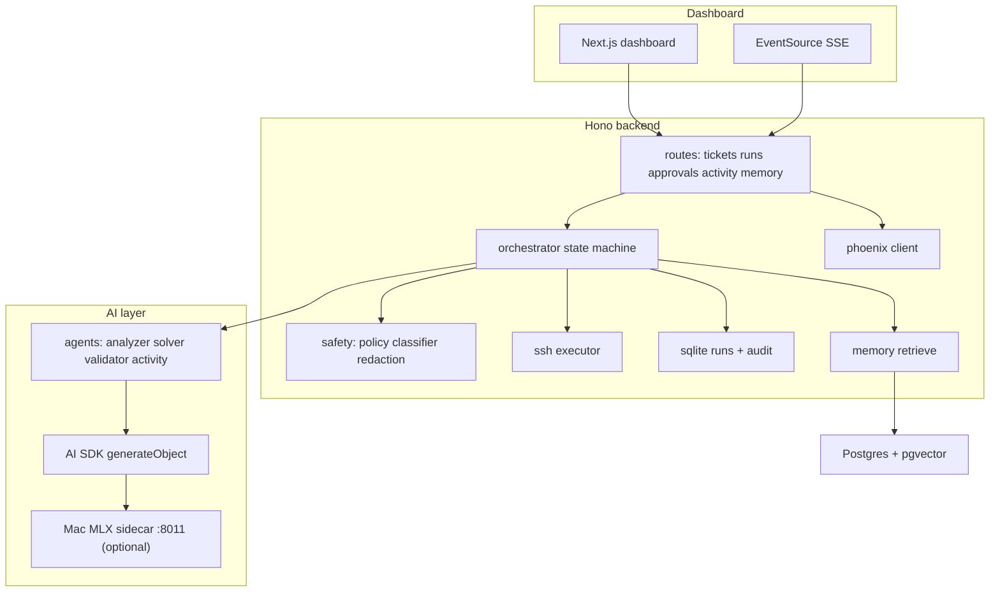
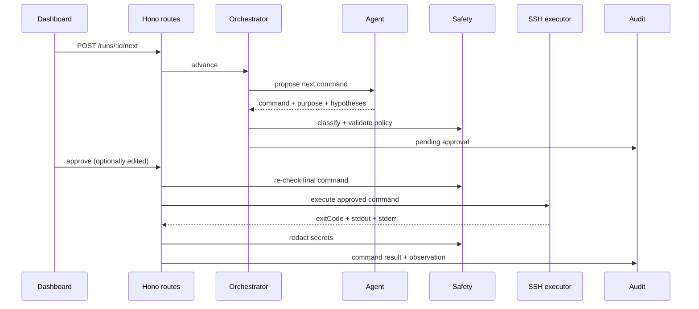

<h1 align="center">Sphinx</h1>

<p align="center">
  Technician-controlled AI troubleshooting copilot for MSP service desks.<br />
  The model proposes, a human approves, the backend executes after deterministic safety checks.
</p>

<p align="center">
  
</p>

<p align="center">
  
  
  
  
  
  
  
  
</p>

## What it is

Sphinx turns a service-desk ticket into a controlled remediation session. A Hono backend
loads tickets from Phoenix ERP, drives an incident-run state machine, and asks specialist
agents to propose one diagnostic or fix command at a time. Each command is classified by a
deterministic safety gate, held for explicit human approval (approve, edit, or reject), and
only then executed over SSH in backend code. Output is redacted, written to an append-only
audit log, fed back as the next observation, and finally distilled into a five-field ERP
activity the technician reviews and submits.

The AI has no execute tool. `ssh/executor.ts` runs only after a human decision and a second
safety re-check on the final command string.

## Quick start

Requires Docker Desktop (or Docker Engine + Compose plugin).

```bash
git clone https://github.com/START-Vienna/techbold_track_template.git
cd techbold_track_template
cp .env.example .env        # mock mode by default, no API keys needed
docker compose up --build
```

| Service     | URL                                    |
| ----------- | -------------------------------------- |
| Dashboard   | http://localhost:3000                  |
| Backend API | http://localhost:8000                  |
| Health      | http://localhost:8000/health           |
| Postgres    | localhost:5432 (autopilot / autopilot) |

`.env.example` sets `MOCK_MODE=true`, so a fresh clone runs the full technician workflow
offline with no Phoenix token, SSH target, or LLM key. `bun run start` is a convenience
wrapper that creates `.env`, generates sandbox SSH keys, waits for health, and prints the
resolved mode. Optional Compose profiles add the sandbox VMs and a secondary FastAPI backend.

## Architecture



The browser only talks to the Hono API. Phoenix tokens, SSH keys, and LLM credentials stay
server-side. Internally the run moves through rich phases (intake, preflight, baseline,
diagnose, plan, apply, validate, document); Phoenix only ever sees OPEN / PENDING / DONE.

## How one approved command flows



The safety gate runs twice: once at proposal, once after any human edit. Execution lives in
`ssh/executor.ts`, never inside an agent tool.

## Safety model

Implemented in [`apps/backend/src/safety/`](apps/backend/src/safety/); full policy in
[`docs/SAFETY_POLICY.md`](docs/SAFETY_POLICY.md).

- Proposal: `validateCommandAgainstPolicy` rejects high-risk commands before approval.
- Approval: full re-check on the (possibly edited) final command.
- Execution: single non-interactive command, connect/command timeouts, output cap, `bash -lc`.
- Logging: `redactSecrets` on every string before audit, UI, or model context.

Blocklist covers recursive deletes, disk format, mass chmod/chown, security disable, secret
dumps, log/history erasure, exfiltration, DB destruction, and privilege-escalation workarounds.

## Agents

Each agent uses AI SDK structured output (`generateObject` + Zod) and cannot execute SSH.
Orchestrator: [`apps/backend/src/ai/orchestrator.ts`](apps/backend/src/ai/orchestrator.ts).

| Agent                    | Role                                       |
| ------------------------ | ------------------------------------------ |
| `problem_analyzer`       | Ranked hypotheses + one diagnostic command |
| `problem_solver`         | Minimal reversible fix + rollback          |
| `validator`              | VERIFIED_FIXED / LIKELY_FIXED / NOT_FIXED  |
| `activity_log_generator` | Five ERP fields from the audit trail only  |

When no runbook matches, the analyzer runs a batched ground-truth sweep (failed units,
journal errors, listeners, resources, recent changes), localizes the failing layer, and
hypothesizes only from observed evidence. Method: [`docs/AGENT_PIPELINE.md`](docs/AGENT_PIPELINE.md).

## Memory

[`apps/backend/src/memory/`](apps/backend/src/memory/) stores redacted solution embeddings in
Postgres + pgvector, with a hash fallback when no DB or embedding key is present. The seed
corpus is public incidents, encoded runbooks, and sandbox training contracts. Vector map at
`/dashboard/memory`.

## Model sidecar (optional)

An optional Mac MLX LoRA adapter (`techbold/msp-autopilot`, base
`mlx-community/Qwen2.5-1.5B-Instruct-4bit`) served OpenAI-compatible on `:8011`. Trained on
the five sandbox archetypes plus deterministic synthetic rows. The model only proposes; the
backend owns safety, approval, execution, and audit. Setup: [`apps/model/README.md`](apps/model/README.md).

```bash
bun run model:train
bun run model:serve   # OpenAI-compatible on :8011
```

Set `MOCK_LLM=false`, `LLM_PROVIDER=local`, `LLM_BASE_URL=http://127.0.0.1:8011/v1` for live
agent calls (Docker backend uses `http://host.docker.internal:8011/v1`).

## Sandbox

Five Docker fake VMs (systemd Ubuntu + SSH, ports 2201-2205) used as a local dev harness and
the model dataset source. Details: [`infra/sandbox/README.md`](infra/sandbox/README.md).

```bash
docker compose --profile sandbox up sandbox
# then set MOCK_SCENARIOS=true in .env and restart the backend (tickets start at 7101)
```

## Stack

| Layer    | Choices                                                                              |
| -------- | ------------------------------------------------------------------------------------ |
| Backend  | Node 22, Hono 4, TypeScript, Vercel AI SDK, ssh2, better-sqlite3, pg + pgvector, Zod |
| Frontend | Next.js 16, React 19, Tailwind v4, shadcn/ui, TanStack Table, Recharts               |
| Model    | Python MLX sidecar (`apps/model`)                                                    |
| Infra    | Docker Compose, Bun workspaces                                                       |
| Quality  | Biome, Vitest, Ruff, Husky lint-staged                                               |

## Local development

```bash
cp .env.example .env
bun install
bun run dev:backend     # API on :8000
bun run dev:frontend    # Next.js on :3000
bun run check           # lint + typecheck + test + build
```

Key env vars live in [`.env.example`](.env.example) (Phoenix API, SSH key path, LLM provider,
mock toggles, `DATABASE_URL`). `env.ts` fails fast on missing required vars when mock mode is off.

## Layout

```
apps/backend/        Hono API, orchestrator, safety, SSH, Phoenix, store, memory
apps/dashboard/      Technician workspace (Next.js)
apps/model/          MLX adapter train + serve
packages/contracts/  Shared API and safety types
infra/sandbox/       Docker VM archetypes + scenario seed
docs/                Architecture, API, safety, runbooks
```

## Limitations

- Targets local Linux service problems (systemd, ports, config, disk, permissions), not
  kernel/network/hardware.
- No production auth, RBAC, or multi-tenancy; single-team local tool.
- Some v2 control routes (`manual-command`, `undo`, `agent.question`) and the
  `customer_system_analyzer` agent are defined but partially deferred.

Details: [`docs/LIMITATIONS.md`](docs/LIMITATIONS.md).

## License

MIT, see [`LICENSE`](LICENSE). Built for the techbold track at START Hack Vienna.
