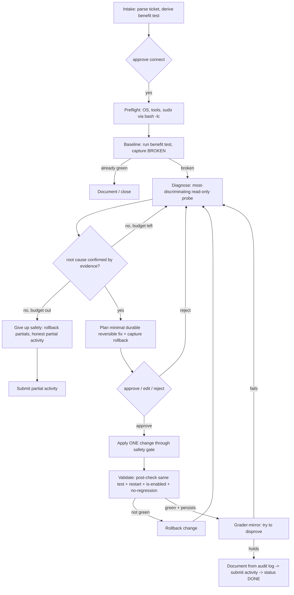

# AGENT_PIPELINE — the optimal path the agent walks

The canonical, opinionated behavioral spec: exactly what the agent does, in what order, with what decision
logic, optimized for **this** task (read ticket → SSH diagnose → durable fix → validate → write activity,
human-gated, safe, reliable). Synthesizes [ARCHITECTURE.md](ARCHITECTURE.md) (state machine),
[RELIABILITY.md](RELIABILITY.md) (failure-mode countermeasures), [SAFETY_POLICY.md](SAFETY_POLICY.md), and
[`knowledge/`](../knowledge/). **The agent only ever *proposes*; deterministic backend code gates, executes,
and records.**

## Design principles (why this path is optimal for this task)
1. **Baseline before everything.** You cannot score a fix without proving the symptom existed and is gone.
   Capture the *broken* signal first; it anchors diagnosis, validation, and the activity's evidence.
2. **Evidence gates, never assumptions.** Each phase must produce a concrete evidence line before the next.
   Defeats the #1 LLM failure (premature/insufficient verification) and the "cause = symptom" trap.
3. **Fewest commands that resolve the most uncertainty.** Eval time + "fewer unnecessary commands" are
   tie-breakers, and long verbose transcripts cause context collapse. Always run the **most discriminating**
   read-only probe next; never spray commands.
4. **On-box truth first.** `man`, `--help`, the actual config, the actual logs beat any external source —
   accurate to *this* system, zero egress. Web is a guarded last resort (P2).
5. **Minimal, durable, reversible fixes.** Smallest change that addresses the *cause*; config-on-disk +
   `enable` so it survives the grader's reboot; capture a rollback before changing anything.
6. **Close the loop.** Re-run the *same* baseline test after the fix, then again after a restart. Only then
   is it `VERIFIED_FIXED`.
7. **Degrade, never gamble.** If unsure or out of budget, revert partials and write an honest partial
   activity. Partial credit beats a fragile workaround that trips a hard-fail or regresses on reboot.

## Human control surface — the human leads, the AI assists (closes REVIEW G1–G12)
The technician is the operator, not a button. At any point, in any phase, they can:
- **Approve / Edit-then-approve / Reject-with-reason** a proposed command (every mutation individually gated).
- **Run their own command** (G1) — type a command directly; it goes through the **same safety classify +
  redact + audit** path, and the result becomes an observation the AI must incorporate. This is how the human
  unsticks/overrides the agent and stays in charge. `POST /runs/:id/manual-command`.
- **Ask / answer** (G11) — the agent can raise a targeted `agent.question` ("need sudo?", "OK to restart X —
  N active connections?"); the human answers and the loop continues. HITL is a conversation, not just approvals.
- **Undo the last change** (G3) — always-available one-click revert via the captured rollback; the revert is
  itself executed + audited and the benefit test is re-run to confirm no regression. `POST /runs/:id/undo`.
- **Pause / Stop / Abort** any time (abort → revert partials → ABORTED + partial activity).
- **Plan-approval for read-only batches** (G4) — diagnostics are shown as ONE reviewable plan approved with a
  single click (each command still classified + audited individually); every mutation stays its own gate.
  Satisfies the rubric's "visible plan + confirm" without approval fatigue.

Behavioral hardening woven into the phases:
- **G2 — never trust one green light / `is-active`.** Proof is the customer-benefit test, never
  `systemctl is-active`. **Match the test to the symptom**: for *intermittent* symptoms ("intermittently
  unavailable") repeat the test over a short interval and fix the *cause of intermittency* (OOM, restart
  loop, resource pressure); a single success → `LIKELY_FIXED`, not `VERIFIED_FIXED`.
- **G5 — idempotency pre-check.** Before a mutation, probe current state; if already desired, skip + note.
- **G6 — dry-run / diff before mutate.** Use native dry-run (`nginx -t`, `apt-get -s`, `--dry-run`) and show a
  **redacted diff** of any config edit on the approval card.
- **G7 — sudo-limited reads.** Preflight records what's readable; when a probe needs root it can't get, the
  agent **says so** (asks) instead of concluding "looks fine."
- **G8 — editing secret-bearing files.** Edit in place without printing values; redact the diff; never `cat` a
  whole secrets file into context — target the specific directive.
- **G9 — no tunnel vision.** Enumerate *all* anomalies the ground-truth sweep lit up before committing to one;
  if the benefit test still fails after a fix, re-enrich (possible second independent fault).
- **G10 — fix the cause, not the symptom.** Grader-mirror explicitly asks "did this address the root cause or
  mask it?" (disk-full → fix the producer/logrotate, not just `rm`; never a restart-loop band-aid).
- **G12 — blast-radius before a restart/stop.** Show dependents (`systemctl list-dependencies --reverse`) +
  active connections (`ss`) + a one-line impact note on the approval card.

## The pipeline (phases 0–8)

| # | Phase / state | Goal | Agent actions (proposes) | Tools | Evidence gate to exit | Human touchpoint |
|---|---|---|---|---|---|---|
| 0 | **Intake** `CREATED→LOADED_CONTEXT` | understand the job, no SSH yet | parse ticket symptom → derive a **candidate customer-benefit test** + route to the likely **runbook slice**; draft a plan | `getTicket`, `getCustomerSystem` (ERP, read-only) | plan + candidate test exist | technician **approves connecting to the VM** (case requires explicit connect approval) |
| 1 | **Preflight** `TRIAGING` | make the shell reliable | ONE batched read-only probe: OS, tool availability, `sudo -n` capability, orientation | `proposeSshCommand` (1 read-only batch) | OS+tools+sudo pinned into context | approve the read-only batch (1 click) |
| 2 | **Baseline + ground-truth sweep** `TRIAGING` | prove the symptom **and** get full context up front | run the **customer-benefit test** (record FAILING evidence) **+ one batched read-only enrichment sweep** (failed units, recent errors, listeners, resources, what-changed) so diagnosis reasons from a complete picture, not a guess | `proposeSshCommand` (1 read-only batch), `read_local_docs` | failing evidence **+ system ground-truth** captured (or already green → 7/abort) | approve the read-only batch (1 click) |
| 3 | **Diagnose** `TRIAGING↔OBSERVING` | find the root cause | ranked hypotheses each with the probe that confirms/refutes it; run the **most discriminating** probe; read on-box docs/logs when unsure; loop until ONE hypothesis is **confirmed by an evidence line** | `proposeSshCommand` (read-only), `read_local_docs` (man/--help/config) | root cause stated **+ cited evidence line** (cause ≠ symptom) | approve each probe (read-only may batch) |
| 4 | **Plan fix** `PLANNING_FIX` | smallest durable reversible fix | design the minimal change addressing the cause (config on disk + `enable`); **capture rollback** (backup file / record unit state); classify risk | `proposeSshCommand` (the fix, gated), safety `classify` | a minimal, durable, reversible fix + rollback ready | — |
| 5 | **Apply** `WAITING_FOR_APPROVAL→EXECUTING` | make the change | propose the fix with rationale + expected effect + rollback; on edit → re-classify | `executeApprovedCommand` (backend-only, after approval) | change executed, result captured | **approve / edit / reject** the change |
| 6 | **Validate** `VALIDATING→[VERIFY]` | prove it, durably | POST-CHECK: re-run the **same** baseline test → GREEN; PERSISTENCE: restart the unit → re-run → still GREEN + `is-enabled`; NO-REGRESSION check; **grader-mirror** ("try to prove it's NOT fixed") | `proposeSshCommand` (read-only) | after-evidence GREEN + persists + no regression → `VERIFIED_FIXED` | approve validation probes |
| 7 | **Document** `DRAFTING_ACTIVITY→SUBMITTING` | clean activity from facts | ActivityWriter builds the 5 fields **from the audit log only**: before-evidence → root cause → actions → commands → after+persistence proof | `createActivity`, `setTicketStatus(DONE)` | activity submitted, ticket DONE | technician **reviews/edits/submits** |
| 8 | **Give-up-safely** `FAILED` (alt terminal) | protect the floor | if budget exhausted / unfixable / only-unsafe-path: **revert partials** (rollback), leave no-regression, write honest partial activity (cause if known, what was tried, why unresolved) | `executeApprovedCommand` (rollback, gated), `createActivity` | system no worse than found; honest activity | technician informed |

## When the error is UNKNOWN (no runbook match) — the first-principles method
This is the generalization engine — the path that actually wins the hidden incidents. Runbooks are a *fast
path* for recognized classes; when nothing matches, the agent **must not guess** — it falls back to a
systematic, evidence-first discovery method that works for *any* local Linux service fault. It follows
**causality and the system's own error reporting**, which exist for every incident, instead of matching a
template.

**1 · Enrich first — the ground-truth sweep (full context from the beginning).** Immediately after preflight,
before any hypothesis, run ONE batched read-only sweep capturing the system's own view of what's wrong and
what changed (output-budgeted; high information per command):
- broken units → `systemctl --failed --no-pager`
- recent errors since boot → `journalctl -p err -b --no-pager | tail -n 40`
- what is / isn't listening → `ss -tulpn`
- resources (common silent causes) → `df -h; df -i; free -m; uptime`
- what changed → `find /etc /var/www /opt -xdev -mmin -1440 -type f 2>/dev/null | head`; `last reboot | head`; `dmesg -T | tail -n 20`
- the customer-benefit test (the BROKEN evidence)

> This is a deliberate up-front investment: a few extra read-only commands here prevent many blind-alley
> commands later → **net fewer commands** (the tie-breaker) and no flailing.

**2 · Localize the failing layer.** Place the fault on the causal chain using the sweep:
`benefit → DNS/network → port/listener → service/unit → process → config/deps → resource (disk/inode/mem/fd)
→ recent change`. The sweep usually lights up exactly one layer (a failed unit, a missing listener, a full
disk, an error line in the journal).

**3 · Follow the chain inward (differential diagnosis).** Walk from the symptom toward the cause, harvesting
the **system's authoritative, generic error channels** at each link — they exist for every service:
`systemctl status X` (active/enabled/last-exit) → `journalctl -u X` (why) → `systemctl cat X` (what it runs)
→ its **config test** (`nginx -t`, `sshd -t`, `apachectl configtest`, `visudo -c`, `<binary> --test`) → its
config file → its deps/sockets/mounts → permissions on the paths it needs → the resource it consumes. In
parallel, the **"what changed?"** axis (recently-modified config, package history, last boot). **Stop
descending the instant a link yields a concrete error** (an exit code, a journal line, a failed config test)
— that line is the root-cause candidate.

**4 · Understand unfamiliar pieces on-box (zero egress).** Hit a service/tool the model doesn't know?
`man X`, `X --help`, `systemctl cat X`, read its config + `/usr/share/doc/X`. It learns *this* system's truth
without guessing or web search.

**5 · Hypothesize FROM evidence, confirm, then act.** Generate hypotheses from what the sweep + chain
revealed (never before), rank by evidence support, and **confirm the top one with a targeted probe** before
proposing any change. No fix on an unconfirmed hypothesis.

**6 · Meta-reasoning / anti-thrash.** If ~3 probes pass without narrowing, the agent **steps back** and emits
a re-orientation — `Known: … · Unknown: … · single most-discriminating next probe: …`. If still not
converging within the diagnostic budget → **give-up-safely**: an honest partial activity documenting the
confirmed evidence + the leading hypothesis (still earns root-cause-attempt + no-regression + summary). It
never flails, and never fixes blind.

**Why this is safe as well as general:** every discovery step is **read-only and evidence-gated**, so an
unknown error can never push the agent into a fabricated or unsafe action. Worst case is a documented "here's
what I found, here's my best hypothesis, I stopped to avoid risk" — which still scores and never hard-fails.

## Decision logic (the branches)
```
after each OBSERVE:
  if benefit test already green at baseline            -> DOCUMENT (already healthy) or re-derive test
  if a hypothesis is CONFIRMED by evidence             -> PLAN FIX
  elif hypotheses remain & step budget left            -> run next most-discriminating probe (DIAGNOSE)
  else (no confirmation, budget low)                   -> deepen one level OR GIVE-UP-SAFELY

after APPLY + VALIDATE:
  if POST-CHECK green AND PERSISTS AND no regression    -> VERIFIED_FIXED -> DOCUMENT
  elif POST-CHECK green but not persistent/ fragile     -> iterate: make it durable (config+enable) or note LIKELY_FIXED
  elif POST-CHECK not green                             -> rollback the change -> back to DIAGNOSE (new hypothesis)
  if fix attempts exhausted                             -> rollback -> GIVE-UP-SAFELY

any time:
  proposed command classifies DENY                     -> blocked, agent must replan (never executes)
  technician rejects                                   -> record reason, propose an alternative
  technician aborts                                    -> rollback partials -> ABORTED + partial activity
```

## Loop budgets & stopping conditions
- **Diagnostic budget:** ~6–10 read-only probes before forcing a root-cause decision or escalation.
- **Fix attempts:** ≤2 distinct fixes; each must be reverted if its POST-CHECK fails before trying another.
- **Total steps:** `MAX_STEPS` (default 20, `stopWhen: stepCountIs`). On reaching it → give-up-safely.
- **Loop detector:** same command proposed twice without new information → escalate (don't repeat).
- **Terminal states:** `VERIFIED_FIXED→DOCUMENT` · budget/unfixable→`give-up-safely` · DENY-only path→stop ·
  human abort→rollback+ABORTED.

## Reliability mechanisms woven in (per [RELIABILITY.md](RELIABILITY.md))
- **Phase 1 tool-preflight** kills the #1 failure (command-not-in-PATH). Run commands via `bash -lc`.
- **Output budgeting** at every OBSERVE: store full output in the DB, feed the model a capped digest +
  extracted signal lines → no context collapse after turn 10.
- **`sudo -n`** discovered in preflight; fixes prefer no-sudo paths; "needs password" is surfaced, never hung.
- **Exit code is truth** (stderr ≠ failure); judge by exit code + the expected signal.
- **Closed-loop** baseline↔post-check uses the **identical** test command for comparable evidence.

## Command efficiency heuristic (minimise commands — a tie-breaker)
Before proposing a probe, the agent states the **expected signal** and **which hypotheses each outcome
eliminates**. Prefer the single command that best partitions the remaining hypotheses (e.g. `systemctl
status X --no-pager` simultaneously reveals active/enabled/last-error — high information per command).
Never run a probe whose result can't change the next action.

## Worked example (nginx-down style — illustrative, not hardcoded)
```
0 Intake: ticket "status API intermittently unavailable", system 10.0.0.5. Candidate test: curl -sS -m5 -I localhost:80 (expect 200). [approve connect]
1 Preflight: bash -lc 'os; have systemctl journalctl ss curl; sudo -n true'  -> Ubuntu 22.04; tools present; SUDO=nopasswd
2 Baseline:  curl -sS -m5 -I http://localhost:80  -> exit 7 / "Connection refused"  [BROKEN captured]
3 Diagnose:  systemctl status nginx --no-pager  -> "inactive (dead)", and "disabled"  [most-discriminating probe]
             journalctl -u nginx -n 20 --no-pager -> "configuration file test failed" (root cause line)
             nginx -t  -> "unknown directive 'severname' in /etc/nginx/sites-enabled/default:12"  [ROOT CAUSE confirmed: typo'd directive]
4 Plan fix:  backup the file (cp default default.bak = rollback); change line 12 severname->server_name; minimal, durable; enable on disk
5 Apply:     [approve edit] sed-fix line 12; nginx -t -> ok; systemctl enable --now nginx
6 Validate:  curl -sS -m5 -I localhost:80 -> 200 [POST-CHECK green]; systemctl restart nginx; curl again -> 200; is-enabled -> enabled [PERSISTS]; nothing else touched [no regression]; grader-mirror: "prove not fixed" -> cannot -> VERIFIED_FIXED
7 Document:  root_cause="invalid nginx directive 'severname' (typo of server_name) failed config test, unit disabled+stopped"; validation_result="curl -I localhost = 200 before/after restart; is-enabled=enabled"; commands_summary="systemctl status/journalctl; nginx -t; edit config; systemctl enable --now; curl -I"; submit; status DONE
```

## Flow diagram


## How this maps to code
- **State machine** owns the phase transitions (`ai/orchestrator.ts`); the model is called per phase with the
  role prompt (`ai/prompts.ts`) and returns **structured output** (diagnostic / validation / activity schemas).
- The model's only shell tool is **`proposeSshCommand`**; the backend runs **safety.classify → human/policy
  approve → executeApprovedCommand** and feeds the redacted, actually-executed result back.
- **`read_local_docs`** (man/`--help`/config) is a read-only on-box tool the agent uses before any external
  lookup; **web search** stays a guarded P2 (advisory-only, outbound-sanitized, audited — see SAFETY_POLICY).
- Runs **identically in manual and policy auto-approve mode**; only the source of the approval decision differs.

## Sources
Closed-loop verify + evidence gates: [RELIABILITY.md](RELIABILITY.md). State machine + tools:
[ARCHITECTURE.md](ARCHITECTURE.md). Safety gate: [SAFETY_POLICY.md](SAFETY_POLICY.md). Diagnostic content:
[`knowledge/diagnostic_playbook.md`](../knowledge/) + [`runbooks/`](../knowledge/runbooks/).
