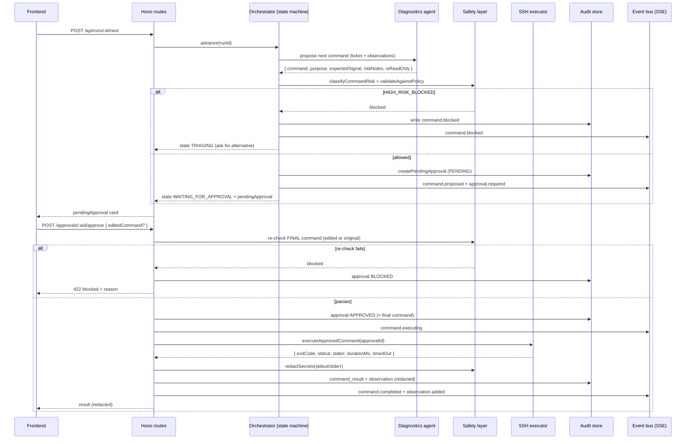
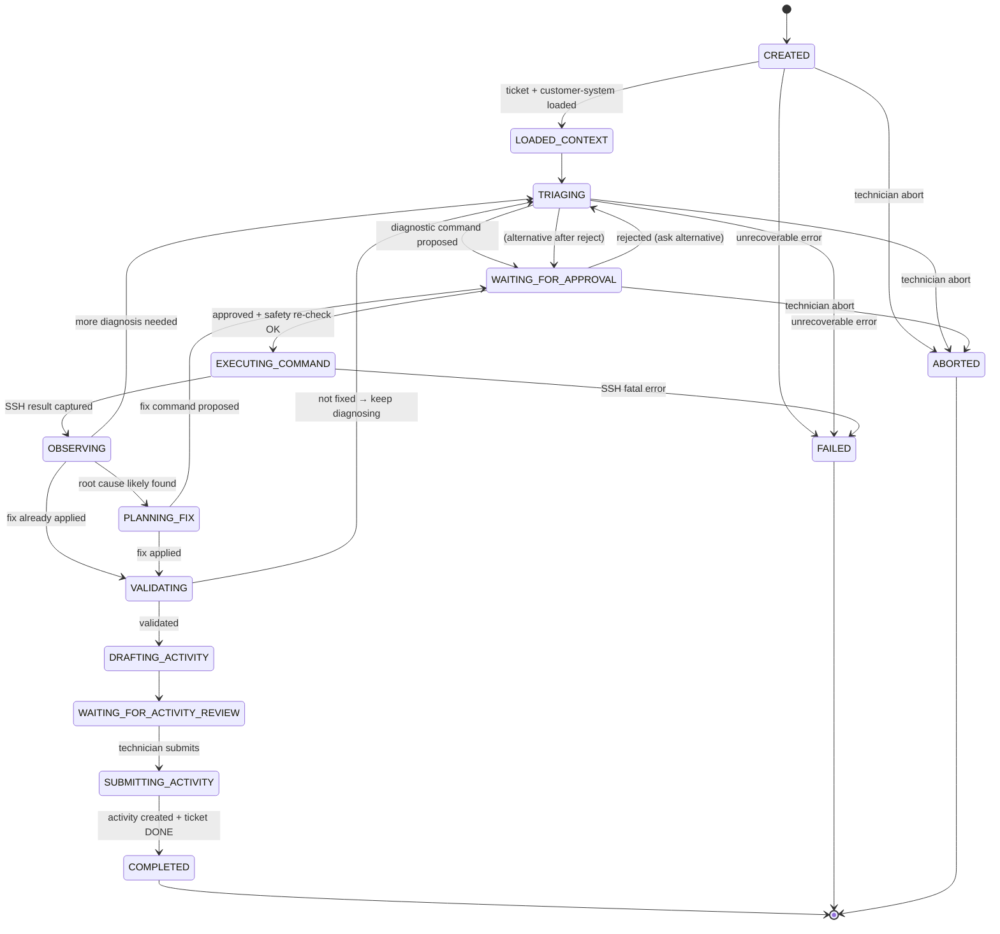

# Architecture — Service Desk Autopilot

Backend-first design. A **deterministic incident-run state machine** owns truth, safety,
approval, SSH execution, audit, and Phoenix writes. The **AI proposes and interprets** — it never
executes. This document is the contract the team builds against.

See also: [PRD.md](./PRD.md) · [SAFETY_POLICY.md](./SAFETY_POLICY.md) · [IMPLEMENTATION_PROCEDURE.md](./IMPLEMENTATION_PROCEDURE.md)

---

## 1. Stack decision (opinionated, final)

| Concern | Choice | Why (and what we rejected) |
|---|---|---|
| Runtime | **Node 22 + pnpm + tsx** | Native fetch/Web Streams; `tsx` = zero-build dev. |
| HTTP API | **Hono** + `@hono/node-server` | Tiny, Web-Standard, first-class `streamSSE`, `zValidator`, `onError`. Rejected Express (no native streaming helper, older middleware model) and Fastify (heavier, plugin ceremony). Rejected keeping **FastAPI** because the agent/tool/safety code and the frontend are both TS — one language, shared Zod types. |
| Model/agent | **Vercel AI SDK v5** | Native tool calling, `generateObject`/`Output.object` structured output, `stopWhen`, `ToolLoopAgent`, HITL approval. Rejected **LangChain/LangGraph**: heavier abstractions, slower to debug at 3am, and we want the *backend* to own the loop, not a framework. |
| Schemas | **Zod** | One schema → validation + TS types + AI SDK tool input + structured output. |
| SSH | **ssh2** | The mature Node SSH client. One command per exec, key auth, timeouts, stdout/stderr/exit-code. Rejected shelling out to system `ssh` (fragile, harder to cap output/timeout). |
| Persistence | **SQLite via better-sqlite3** (Drizzle optional) | Synchronous, zero-server, single file = durable audit log. **JSONL fallback** if DB setup stalls. Rejected Postgres (server to run, no payoff in 24h). |
| Streaming | **SSE** from Hono | One-way run events. Rejected WebSockets (bidirectional lifecycle we don't need; commands go over POST). |
| Tests | **Vitest** | Safety policy, Phoenix client (mocked fetch), orchestrator (mocked SSH + model). |
| Loop shape | **State machine wrapping single-shot LLM calls** | Each `/next` = one planning turn. Rejected a long-running suspended agent loop (hard to pause for out-of-band human approval and survive a process blip). |

### Hono vs Express/Fastify/FastAPI — short version
Hono gives us `streamSSE`, Zod validation middleware, and a clean modular `app.route()` structure
out of the box, on Web Standards, in the same language as the agent and frontend. FastAPI would
mean two languages and re-implementing the agent/tool/safety types twice. Express/Fastify work but
add ceremony for the streaming we need.

### AI SDK native tools vs LangChain/LangGraph
We need: typed tools, structured output, a bounded multi-step loop, and **the backend to keep
control of execution**. AI SDK gives all of that with thin, inspectable primitives. LangGraph's
graph/checkpointer model is powerful but is more to learn and debug than a hand-rolled state
machine we fully understand — and understanding-under-pressure is the real constraint.

### Single orchestrator loop vs many independent agents
**One orchestrated loop with specialist *roles*.** The "agents" (Diagnostics, Fix Planner,
Validator, Activity Writer) are distinct prompts + output schemas invoked by one orchestrator —
not independent processes. This *feels* agentic in the UI but stays linear and debuggable.

### Agentic design vs deterministic state machine
Both. The **state machine is the skeleton** (it owns transitions, approvals, execution, audit).
The **AI is the muscle in specific states** (propose command, interpret output, draft prose).
The model can be wrong without being dangerous, because it never holds the execute tool.

---

## 2. Folder structure

```
backend/
  package.json
  tsconfig.json
  src/
    index.ts                 # node-server bootstrap (serve(app))
    env.ts                   # zod-validated process.env
    app.ts                   # Hono app: middleware, routes, onError
    routes/
      health.ts
      tickets.ts             # GET /api/me, /api/tickets[...], PATCH status
      runs.ts                # POST /api/runs, GET /api/runs/:id, /next, /abort
      approvals.ts           # approve / reject
      activity.ts            # draft / submit
      events.ts              # GET /api/runs/:id/events (SSE)
    phoenix/
      client.ts              # typed Phoenix ERP wrapper (auth, retries, timeouts)
      mock.ts                # in-memory Phoenix for tests + offline demo
      types.ts               # Zod schemas from phoenix-openapi.yaml
    ssh/
      client.ts              # ssh2 connection (key auth, connect timeout)
      executor.ts            # run ONE approved command: timeout, output cap, exit code
      mock.ts                # scripted SSH responses for tests + offline demo
      types.ts
    ai/
      model.ts               # provider + model config (bring-your-own key)
      prompts.ts             # system prompts per role (see §8)
      orchestrator.ts        # the state machine driver (the brain stem)
      agents/                # names mirror the brief's suggested agents
        problem-analyzer.ts          # ranked hypotheses + next diagnostic command (structured)
        customer-system-analyzer.ts  # system-context summary from read-only probes
        problem-solver.ts            # propose minimal reversible fix command (structured)
        validator.ts                 # decide fixed/likely/not + persistence check (structured)
        activity-log-generator.ts    # draft 5 ERP fields from audit trail (structured)
      tools/
        phoenix-tools.ts     # listTickets/getTicket/getCustomerSystem/createActivity/setStatus
        ssh-tools.ts         # proposeSshCommand (NO execute) ; executeApprovedCommand (backend-only)
        audit-tools.ts       # writeAuditEvent / listObservations / getRunState
        safety-tools.ts      # classifyCommandRisk / validateCommandAgainstPolicy / redactSecrets
    safety/
      command-policy.ts      # deterministic allow/block + validate (the gate)
      classifier.ts          # risk level (deterministic first; optional LLM second opinion)
      redaction.ts           # strip secrets from any text before log/UI/model
      risk-levels.ts         # RiskLevel enum + helpers
    store/
      db.ts                  # better-sqlite3 (or JSONL) init
      schema.ts              # tables / zod row schemas
      runs.ts                # run lifecycle CRUD
      audit.ts               # append-only audit + approvals + results + observations
    events/
      run-event-bus.ts       # per-run EventEmitter → SSE subscribers
      sse.ts                 # streamSSE wiring
    tests/
      safety.test.ts         # blocklist hard-fails, edited-command recheck, redaction
      phoenix-client.test.ts # mocked fetch: tickets, 401, 404, empty, activity create
      orchestrator.test.ts   # mocked SSH+model: full happy path + reject path
```

This mirrors the rubric-E named modules verbatim: **ERP client** (`phoenix/`), **SSH runner**
(`ssh/`), **safety layer** (`safety/`), **agent** (`ai/`), **audit log** (`store/audit.ts`),
**activity generator** (`ai/agents/activity-log-generator.ts`). A judge reading `src/` sees the
rubric — and the agent filenames echo the brief's own `problem_analyzer`/`customer_system_analyzer`/
`problem_solver`/`activity_log_generator`. The jury wrote the case; speak their vocabulary.

---

## 3. Request → execution flow (one approved command)



**Invariant:** the model's proposed command and the *executed* command pass through the safety
gate **twice** — once at proposal, once after any human edit. Execution only ever happens in
deterministic backend code (`ssh/executor.ts`), never inside an AI tool `execute`.

---

## 4. Incident-run state machine

The AI does **not** own state. `orchestrator.ts` is a pure function of `(currentState, event) →
nextState + sideEffects`. Internal run phases are rich; Phoenix only ever sees `OPEN`/`PENDING`/`DONE`.



**Phase → Phoenix status mapping** (only applied when we PATCH):
- run active (any working phase) → optionally `PENDING`
- `COMPLETED` (after activity submitted) → `DONE`
- `ABORTED`/`FAILED` → leave `OPEN` (or `PENDING`); never mark `DONE` without a validated fix.

**`max steps` guard:** the orchestrator caps total proposed commands per run (e.g. 12). On cap it
transitions to `WAITING_FOR_ACTIVITY_REVIEW` with whatever was found (honest "could not fully
validate") rather than looping forever — protects the eval-time tie-breaker and avoids runaway cost.

---

## 5. Why audit persistence is part of the *product*, not plumbing

Rubric C gives **4 points for a complete audit trail** and treats hidden/secret-deleting/log-clearing
behaviour as a **hard-fail**. The audit log is also the **only allowed source of truth for the
activity** (rubric B: no invented actions). So the audit store is a *feature*: it's what the judge
inspects, what the activity is generated from, and what proves human control. We treat it as
append-only and never delete from it — deleting audit history is itself a hard-fail behaviour.

---

## 6. Data model

SQLite tables (or JSONL collections with the same shape). All timestamps ISO-8601 UTC.

```ts
// store/schema.ts (shape; Drizzle or raw better-sqlite3)
runs {
  id TEXT PRIMARY KEY,            // run_<ulid>
  ticket_id INTEGER,
  customer_system_id TEXT,        // ip:port (no secrets)
  status TEXT,                    // state machine phase
  current_phase TEXT,
  started_at TEXT, updated_at TEXT, completed_at TEXT,
  error_message TEXT
}

audit_events {                    // append-only, never deleted
  id TEXT PRIMARY KEY,            // ev_<ulid>
  run_id TEXT,
  type TEXT,                      // == SSE event type
  actor TEXT,                     // system | technician | agent | phoenix | ssh
  ts TEXT,
  payload_json TEXT               // redacted before write
}

command_approvals {
  id TEXT PRIMARY KEY,            // appr_<ulid>
  run_id TEXT,
  proposed_command TEXT,
  edited_command TEXT,            // null unless technician edited
  final_command TEXT,            // what actually ran
  purpose TEXT, expected_signal TEXT,
  risk_level TEXT,               // SAFE_READ_ONLY | LOW_RISK_CHANGE | MEDIUM_RISK_CHANGE | HIGH_RISK_BLOCKED
  safety_notes TEXT,
  status TEXT,                   // PENDING | APPROVED | REJECTED | EXECUTED | BLOCKED
  technician_reason TEXT,
  created_at TEXT, decided_at TEXT, executed_at TEXT
}

command_results {
  id TEXT PRIMARY KEY,
  run_id TEXT, approval_id TEXT,
  command TEXT,
  exit_code INTEGER,
  stdout_redacted TEXT,          // capped + redacted
  stderr_redacted TEXT,          // capped + redacted
  duration_ms INTEGER,
  timed_out INTEGER,             // 0/1
  created_at TEXT
}

observations {
  id TEXT PRIMARY KEY,
  run_id TEXT,
  source TEXT,                   // ssh | phoenix | agent | technician
  content TEXT,                  // redacted, model-readable summary
  created_at TEXT
}

activity_drafts {
  id TEXT PRIMARY KEY,
  run_id TEXT,
  summary TEXT, root_cause TEXT, actions_taken TEXT,
  commands_summary TEXT, validation_result TEXT,
  submitted INTEGER, created_at TEXT, submitted_at TEXT
}
```

The agent reads `observations` + `command_results` + the ticket; it never reads raw secrets
(redaction happens before write). The activity writer reads only these tables.

---

## 7. Agent architecture (roles in one loop)

All agents use AI SDK structured output (`generateObject` / `Output.object`) with a Zod schema, so
their results are typed and never free-form when the backend needs to act on them. None of them
can execute SSH.

> **Agent names follow the brief's vocabulary** (`problem_analyzer`, `customer_system_analyzer`,
> `problem_solver`, `activity_log_generator`) so the jury — who wrote the case — recognises the
> structure. Our role names map 1:1; use the brief's names in code and UI.

| Agent (brief name) | Input | Output schema | Rule |
|---|---|---|---|
| **Orchestrator** | run state, last observation | next state decision + short progress summary | Picks the next role; never proposes a raw command itself; emits `agent.thought_summary`. |
| **`problem_analyzer`** (diagnostics) | ticket symptom, observations so far | `DiagnosticProposal` (§8) incl. **ranked hypotheses + evidence** | One command, prefer read-only, explain expected signal. Surfaces the ranked hypothesis list the technician picks from (brief's "what great looks like"). Scope = local Linux services only. |
| **`customer_system_analyzer`** | customer-system info + early read-only probes | system context summary (OS, services, ports, disk) | Establishes the lay of the land before fixes; feeds the analyzer. Read-only. |
| **SafetyReviewer** | a command string | `RiskAssessment` | **Deterministic policy first**; optional LLM second opinion. Can only *raise* concern, never override a deterministic block. |
| **`problem_solver`** (fix planner) | chosen root-cause hypothesis + observations | `FixProposal` | Minimal, reversible, includes rollback/justification; no broad destructive ops; prefer reboot-persistent fixes. |
| **Validator** | fix + post-fix observations | `ValidationResult` (§8) | Distinguishes `VERIFIED_FIXED` vs `LIKELY_FIXED`; **proposes a persistence/reboot check** (graded). |
| **`activity_log_generator`** | audit trail (results + observations) | `ActivityDraft` (5 fields) | Uses only observed facts; invents nothing; never includes secrets. |

**Tool exposure rule (the crux):** the diagnostics/fix agents may call `proposeSshCommand` — a
tool **with no `execute`** (or whose execute only records a pending proposal and returns
`"queued for human approval"`). The real `executeApprovedCommand` lives in backend code and is
**never registered as a model tool**. This is stronger than AI SDK `needsApproval` because the
model literally has no path to execution.

> **AI-SDK-native alternative (only if time allows):** register the run command as a single tool
> with `needsApproval: true` / `toolApproval: { runCommand: 'user-approval' }` and drive approvals
> through `useChat`'s `addToolApprovalResponse`. We keep the propose/execute split as primary
> because it's easier to audit and survives a backend restart between propose and execute.

---

## 8. Tool & structured-output contracts

```ts
// ai/tools/ssh-tools.ts
export const proposeSshCommand = tool({
  description: 'Propose ONE shell command to run on the customer VM for human approval. Does NOT execute.',
  inputSchema: z.object({
    command: z.string(),
    purpose: z.string(),                 // why this command, in one line
    expectedSignal: z.string(),          // what output would confirm/deny the hypothesis
    riskNotes: z.string(),
    isReadOnly: z.boolean(),
  }),
  // NO execute: returning a proposal record is the backend's job.
});

// Backend-only — NOT a model tool:
export async function executeApprovedCommand(approvalId: string): Promise<CommandResult> { /* ssh2 */ }
```

```ts
// Phoenix tools (typed wrappers over phoenix/client.ts)
// CORE THREE (load-bearing, scored): listAssignedTickets, getCustomerSystem, createActivity
listAssignedTickets(query?) ; getCustomerSystem(ticketId) ; createActivity(ticketId, fields) ;
// BEST-EFFORT (degrade gracefully if the live mock omits them; unscored):
getTicket(id) /* else derive from list */ ; getCustomer(customerId) ; getMe() ; updateTicketStatus(ticketId, status)

// Run/audit tools
getRunState(runId) ; writeAuditEvent(runId, event) ; listObservations(runId) ;
createPendingApproval(runId, proposal)

// Safety tools (deterministic; LLM optional)
classifyCommandRisk(command) -> RiskLevel
validateCommandAgainstPolicy(command) -> { allowed: boolean, reason?: string, riskLevel }
redactSecrets(text) -> string
```

**Structured outputs** (Zod schemas the agents must return):

```jsonc
// DiagnosticProposal — diagnosis-first: rank hypotheses with evidence, then ONE command
{ "phase": "diagnosis",
  "hypotheses": [                       // ranked, most-likely first (brief's "what great looks like")
    { "rootCause": "string", "confidence": 0.0, "evidence": ["observed fact 1", "..."] }
  ],
  "command": "string",                  // the single next command to confirm the top hypothesis
  "purpose": "string", "expectedSignal": "string", "riskNotes": "string", "isReadOnly": true }

// FixProposal
{ "phase": "fix", "rootCauseHypothesis": "string", "command": "string",
  "purpose": "string", "expectedSignal": "string", "rollback": "string", "isReadOnly": false }

// ValidationResult
{ "validationStatus": "VERIFIED_FIXED" | "LIKELY_FIXED" | "NOT_FIXED" | "UNKNOWN",
  "evidence": ["string"], "nextRecommendedStep": "string" }

// ActivityDraft (the 5 graded fields)
{ "summary": "string", "root_cause": "string", "actions_taken": "string",
  "commands_summary": "string", "validation_result": "string" }
```

---

## 9. Prompting strategy

Shared rules baked into every system prompt (`ai/prompts.ts`):

- You **propose**; you never execute. A human approves every command.
- Use **only** facts from the provided ticket and observed command outputs. **Never invent**
  results, file paths, service names, or fixes you haven't confirmed.
- **One command per turn.** Prefer the single most informative **read-only** diagnostic.
- Always state the **expected signal**: what output confirms vs denies your hypothesis.
- Exhaust diagnosis before proposing any change. Fixes must be **minimal and reversible**.
- Track explicit **root-cause hypotheses**; admit uncertainty rather than guessing.
- Never propose blocklisted/blanket-destructive commands, never read or echo secrets, never
  disable security controls, never clear logs/history, never escalate to superuser to dodge perms.
- Output **only** the required JSON schema for your role.

Role-specific system prompts (sketch):

- **`problem_analyzer` (diagnostics):** "Every incident is a **local Linux service problem** — a
  service, port, config, disk, permission, log, cron or dependency issue — never kernel/network/
  hardware. Output one `DiagnosticProposal`: first a **ranked list of root-cause hypotheses with the
  evidence** for each, then the single next command to confirm the top one. Prefer
  `systemctl status <svc>`, `journalctl -u <svc> -n 100 --no-pager`, `ss -tulpn`, `df -h`,
  `free -m`, `tail`/`grep` of a *specific* log. Narrow to a root cause; don't fish."
- **Fix Planner:** "Output one `FixProposal` that addresses the *root cause*, not the symptom.
  Minimal, reversible, with a rollback. No reinstall/reformat/broad chmod. Restart only the
  specific affected service."
- **Validator:** "Output a `ValidationResult`. Only say `VERIFIED_FIXED` if an observation
  concretely proves the customer benefit is restored *and* would survive a restart. Otherwise
  `LIKELY_FIXED` + a persistence check to run."
- **Activity Writer:** "Using only the audit trail provided, output the 5 `ActivityDraft` fields.
  `root_cause` = technical cause not symptom. `commands_summary` = command classes, **no secrets**.
  `validation_result` = the concrete proof from validation. If something wasn't observed, don't claim it."

### Example diagnostic output
```json
{ "phase": "diagnosis",
  "hypotheses": [
    { "rootCause": "status-api systemd unit failed on a stale PID/port bind", "confidence": 0.6,
      "evidence": ["ticket: 'API intermittently unavailable'", "service-class symptom, not network"] },
    { "rootCause": "disk full preventing the service from writing", "confidence": 0.25,
      "evidence": ["intermittent failures can indicate transient resource exhaustion"] }
  ],
  "command": "systemctl status status-api --no-pager",
  "purpose": "Confirm whether the service is active and why it last failed.",
  "expectedSignal": "active(running)=healthy; failed/inactive=down, then read its journal next.",
  "riskNotes": "Read-only systemd query, bounded output, no secrets.", "isReadOnly": true }
```

### Example validation output
```json
{ "validationStatus": "VERIFIED_FIXED",
  "evidence": ["curl -I localhost:8080 => HTTP/1.1 200", "systemctl is-active status-api => active"],
  "nextRecommendedStep": "Optional: reboot smoke check to confirm persistence." }
```

---

## 10. Cross-cutting concerns

- **Error handling / timeouts / retries (rubric E):** Phoenix client wraps `fetch` with an
  AbortController timeout + 1 bounded retry on 5xx/network (never on 4xx); maps 401/404/422 to
  typed errors surfaced as clean UI states. SSH executor sets a connect timeout and a per-command
  timeout, kills the channel on overrun, caps stdout/stderr length. AI calls are wrapped with a
  timeout + single retry; a model failure degrades to "agent unavailable, propose manually",
  never to an unsafe default.
- **Redaction (rubric C):** `safety/redaction.ts` runs on **every** string before it is written to
  the audit log, returned to the UI, or fed back to the model. Patterns: env-var-looking secrets,
  private keys, `password=`/`token=`/`Authorization:` values, connection strings. Redaction is a
  pure function with its own unit tests.
- **CORS:** open for local dev (`*`) — single local tool, no cookies, no auth.
- **Config:** `env.ts` parses `process.env` through Zod and fails fast with a readable message if a
  required var is missing. Secrets only from env; the SSH key is read from the path mounted at
  `/keys` (Docker) — never inlined, never logged.

---

## 10b. Additions folded from `minam` — human control, reliability hardening, diagnostic depth

These extend §3/§4/§8/§10; full detail in [RELIABILITY.md](./RELIABILITY.md) + [AGENT_PIPELINE.md](./AGENT_PIPELINE.md).

**Human-control endpoints + events (G1/G3/G11/G4):**
- `POST /api/runs/:id/manual-command` — human-typed command → same safety classify+redact+audit → executed → fed back as an observation. Emits `manual.command.executed`.
- `POST /api/runs/:id/undo` — revert the last change via the captured rollback; re-run the benefit test. Emits `command.undone`.
- `POST /api/runs/:id/questions/:qid/answer` + an `agent.question` event — agent→human question channel.
- Read-only diagnostics may be batched into one **plan-approval**; every mutation stays individually gated.

**SSH / reliability hardening (counters the documented top failure modes — see RELIABILITY.md §1,§4):**
- Run each command via **`bash -lc '<cmd>'`** (login PATH) — defeats the #1 Terminal-Bench failure ("command not in PATH", ~24% of failures). Absolute paths for system binaries.
- **`sudo -n`** (non-interactive) — never hang on a TTY password prompt; treat "needs password" as data and surface it.
- **Exit code is truth; stderr ≠ failure** — judge success by exit code + the expected signal (many tools write to stderr on success).
- **Tool-availability preflight** — the first read-only batch probes OS + which tools exist + sudo capability; the agent then uses only present tools.
- **Output budgeting** — store full output in the DB; feed the model a capped **digest** + extracted signal lines (prevents context collapse after ~turn 10). Set `LANG=C` for stable parsing.

**`read_local_docs` tool** — on-box `man`/`--help`/`systemctl cat`/config reads (zero egress) so the agent understands unfamiliar services without web search. (Optional guarded web search is P2 — advisory-only, outbound-sanitized, audited.)

**Unknown-error method:** the diagnostics role runs a **ground-truth enrichment sweep** (failed units, journal errors, listeners, resources, what-changed) before hypothesizing, then follows the causal chain inward via the system's own error channels. Full method in [AGENT_PIPELINE.md](./AGENT_PIPELINE.md).

---

## 11. Research notes / sources
- **Official techbold case brief** — agent names, incident scope (local Linux services only),
  diagnosis-first ranked-hypotheses pattern, two-evaluation structure, core-3 ERP endpoints.
- Vercel AI SDK v5 (Context7 `/vercel/ai`): `tool({ inputSchema, execute })`, `generateObject`,
  `Output.object`, `stopWhen: stepCountIs`, `ToolLoopAgent`, `needsApproval`/`toolApproval`,
  `addToolApprovalResponse`. https://ai-sdk.dev/docs
- Hono (Context7 `/websites/hono_dev`): `@hono/node-server`, `streamSSE` (`writeSSE`/`onAbort`/
  `aborted`), `@hono/zod-validator`, `app.onError`, timeout middleware. https://hono.dev/docs
- ssh2: https://github.com/mscdex/ssh2 — `Client.exec`, key auth, timeouts.
- OpenClaude: https://github.com/Gitlawb/openclaude — pattern: tool-driven loop that pauses on
  sensitive commands and emits an approval event before executing (we adopt the pattern, not the code).
- Repo OpenAPI: `docs/phoenix-openapi.yaml` (TicketStatus = OPEN|PENDING|DONE; activity fields).
