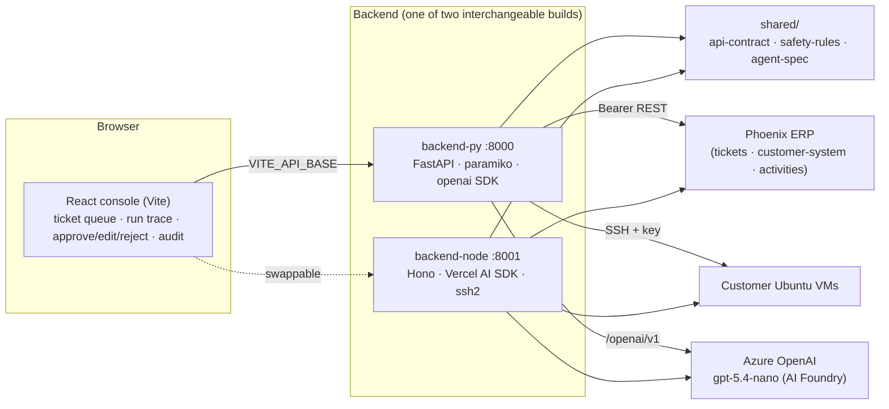
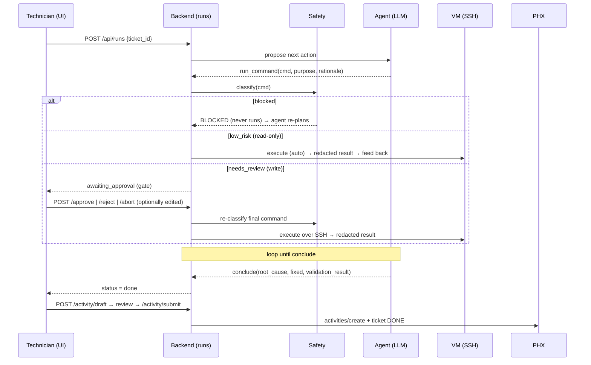
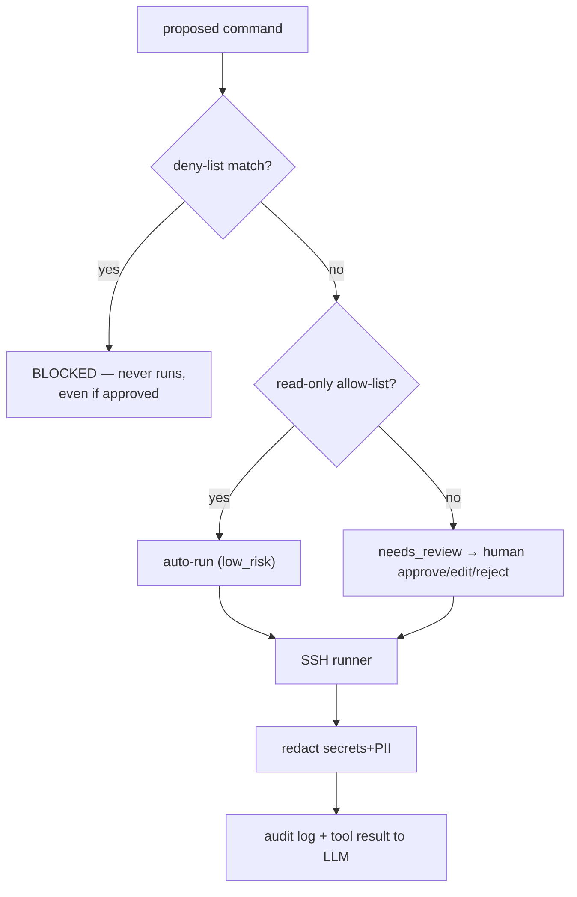

# Architecture — Sphinx · AI Service Desk Autopilot

A technician-controlled AI copilot that reads Phoenix ERP tickets, troubleshoots the affected
Linux VM over SSH **under a human gate**, validates the fix, and writes a clean activity back to
the ERP. This document is the engineering map; see [REPORT.md](../REPORT.md) for the design
narrative, [INFRASTRUCTURE.md](INFRASTRUCTURE.md) for deployment, and [SCORECARD.md](SCORECARD.md)
for the rubric self-assessment.

---

## 1. System context

**Two interchangeable backends, one shared core.** The frontend talks to one HTTP contract
([`shared/api-contract.md`](../shared/api-contract.md)); either backend can serve it. The expensive,
correctness-critical assets — the **safety rules** ([`shared/safety-rules.json`](../shared/safety-rules.json)),
**agent spec** ([`shared/agent-spec.md`](../shared/agent-spec.md)), and the **API contract** — live once
in `shared/` and are consumed by both, so the second backend is thin glue, not double work. The
safety rules are validated in **both** Python `re` and JS `RegExp` (25/25 tests) so the two builds
behave identically.

---

## 2. Module breakdown (rubric E: modular separation)

Each backend keeps the same responsibilities in separate, testable modules:

| Concern | backend-py | backend-node | Responsibility |
|---|---|---|---|
| Config | `app/config.py` | `src/config.ts` | typed env/secrets (never logged) |
| ERP client | `app/erp.py` | `src/erp.ts` | Phoenix REST: auth, retries, timeouts, error mapping |
| SSH runner | `app/ssh.py` | `src/ssh.ts` | one approved command, multi-key auth, timeouts, output cap |
| Safety layer | `app/safety.py` | `src/safety.ts` | deny/allow classify + secret/PII redaction |
| LLM client | `app/llm.py` | `src/llm.ts` | provider switch (azure/openrouter/local) + input guard |
| Agent | `app/agent.py` | `src/agent.ts` | prompt + tools → the next single action |
| Runs (state machine) | `app/runs.py` | `src/runs.ts` | the human-in-the-loop engine + audit + emit |
| Activity generator | `app/activity.py` | `src/activity.ts` | drafts the graded ERP documentation |
| HTTP routes | `app/main.py` | `src/index.ts` | the shared contract |

Frontend: `App.tsx` (console), `api.ts` (typed client), `types.ts`, `demo.ts` (scripted replay).

---

## 3. The run lifecycle (step-wise human-in-the-loop)

The agent is asked for **exactly one action per turn** (`run_command` or `conclude`). Read-only
diagnostics run automatically; **every write pauses for a human decision** that spans separate HTTP
requests — making the gate server-authoritative and the audit trail exact.

Run/step/audit data shapes are defined in [`shared/api-contract.md` §3](../shared/api-contract.md).
Run state is held **in-memory** (single-user demo); swap the store for a DB to persist.

---

## 4. Safety architecture (rubric C)

Defense in depth, deterministic-first (never trust the model for safety):

- **Deterministic deny-list** hard-blocks the rubric hard-fails: `rm -rf /…`, `chmod -R 777` on
  system dirs, recursive `chown`/`chmod` on system roots, DB drops, firewall/audit disabling,
  `curl … | sh`, log/history wiping, writes to critical `/etc` files, user+home deletion. Blocked
  commands never execute.
- **Risk-tiered human gate** — read-only diagnostics auto-run; **every write** requires
  approve/edit/reject. Concentrates attention on state changes instead of training rubber-stamping.
  `AUTO_RUN_READONLY=false` reverts to approve-everything.
- **LLM input guard** — secrets + PII (passwords, tokens, JWT/AWS/GitHub keys, connection-string
  credentials, emails, private keys) are scrubbed from **every** message sent to the model, the
  audit log, and the ERP activity. The SSH private key never leaves the backend.
- **Full audit trail** — every proposal, decision, execution (with exit code), and key action.

---

## 5. The agent

- **Tools (no auto-execute):** `run_command(command, purpose, rationale)` and
  `conclude(root_cause, fixed, validation_result)`. The backend intercepts each `run_command` as the
  approval gate. Node defines the AI SDK tools **without** an `execute` function so the loop and
  safety stay in our code.
- **System prompt** ([`shared/agent-spec.md`](../shared/agent-spec.md)): diagnosis-first, smallest
  targeted fix, **persistence-aware** (`systemctl enable --now`, persisted config — the grader
  reboots), validate with concrete proof, minimal changes, no secret exfiltration, one command per
  turn. Built for **generalisation** (no hardcoded incidents).
- **Models:** primary Azure `gpt-5.4-nano` (native function calling); fallback local Qwen3-Coder-30B;
  switch via `LLM_PROVIDER`. Because nano is small: simple tool defs, validated tool-call JSON with a
  repair path, and structured output for the activity. The Azure endpoint is an **AI Foundry project**
  endpoint, routed through the OpenAI-compatible `/openai/v1` surface (see INFRASTRUCTURE.md).

---

## 6. Tech stack

React 18 + Vite + TypeScript · FastAPI + paramiko + OpenAI SDK · Hono + Vercel AI SDK v6
(`@ai-sdk/azure`/openai-compatible) + ssh2 · Azure OpenAI `gpt-5.4-nano` (+ local Qwen fallback) ·
Docker Compose · pytest / tsc / dual-engine regex tests.

---

## 7. Observability & live progress

Every action streams into the **audit/event log** rail. **Live trace via SSE:** the run engine runs
the agent loop in a background thread and `emit()`s a full run snapshot to subscribers on every state
change. `GET /api/runs/{id}/events` streams them and the frontend `EventSource` updates the trace in
real time as the agent diagnoses and fixes. A scripted `?demo=1` replay drives the full loop for
recording the demo video.

## 8. Local sandbox (offline cases)

For fully-local development and as an eval harness, `SANDBOX_CASE_COUNT>0` spins up broken Ubuntu
containers (`sandbox/scenarios`) behind a Phoenix-compatible sandbox ERP, so the entire loop —
tickets → SSH → fix → activity — runs on localhost with **no Builder Base creds and no real customer
VM**. It pairs naturally with `LLM_PROVIDER=local` (see [LOCAL-MODEL.md](LOCAL-MODEL.md)) for a 100%
on-prem run, and is the held-out test bed for the QLoRA roadmap.
