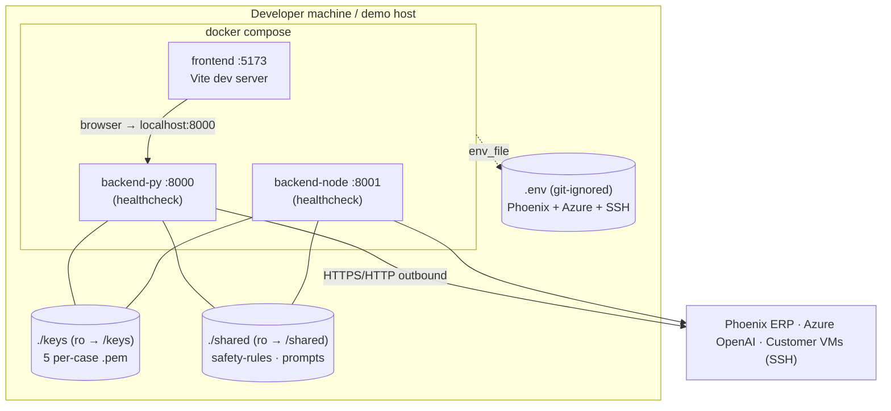

# Infrastructure & Deployment — Sphinx · AI Service Desk Autopilot

How the system is packaged, configured, networked, and run. See
[ARCHITECTURE.md](ARCHITECTURE.md) for the component design.

---

## 1. Topology



| Service | Port | Image base | Start command | Healthcheck |
|---|---|---|---|---|
| `frontend` | 5173 | node:20-slim | `npm run dev` (Vite) | (waits for backend-py healthy) |
| `backend-py` | 8000 | python:3.11-slim | `uvicorn app.main:app` | `urllib → /health` |
| `backend-node` | 8001 | node:20-slim | `tsx src/index.ts` | `fetch → /health` |

`docker compose up --build` → frontend at http://localhost:5173. The browser calls
`VITE_API_BASE` (default `:8000`); set it to `:8001` to demo the Node build. Verified end-to-end:
both backends healthy, serving live Phoenix tickets, with keys + shared rules mounted.

---

## 2. Networking

- **Browser → frontend (:5173) → backend (:8000/:8001)** over `localhost` (ports published by compose).
- **Backend → outbound**: Phoenix ERP (REST, Bearer), Azure OpenAI (HTTPS), and the customer VMs
  (SSH/22). Containers have outbound internet by default — no inbound exposure of the VMs.
- `extra_hosts: host.docker.internal:host-gateway` lets a container reach host-run services (a local
  Phoenix mock on `:9000`, or a local LLM on `:1234`).

---

## 3. Configuration & secrets

All secrets live in **`.env`** (git-ignored); `.env.example` is the committed, secret-free template.

| Variable | Purpose |
|---|---|
| `PHOENIX_API_BASE_URL`, `PHOENIX_API_TOKEN` | ERP base URL + team Bearer token |
| `SSH_PRIVATE_KEY_PATH`, `SSH_KEY_DIR`, `SSH_USERNAME` | SSH target; runner tries every `*.pem` in `SSH_KEY_DIR` until one authenticates |
| `LLM_PROVIDER` | `azure` (default) · `openrouter` · `local` |
| `AZURE_OPENAI_ENDPOINT/_API_KEY/_API_VERSION/_DEPLOYMENT` | Azure `gpt-5.4-nano` |
| `OPENROUTER_*`, `LOCAL_*` | alternative / fallback providers |
| `AUTO_RUN_READONLY` | `true` (default) auto-runs read-only diagnostics; `false` = approve everything |
| `SHARED_DIR` | mount point for shared rules (`/shared` in Docker) |
| `VITE_API_BASE` | which backend the browser calls |

**Secret hygiene (rubric C / E):** `.env`, `keys/`, `important_stuff.txt`, and `tb-hackathon-ssh/`
are git-ignored. Every commit is run through a secret scan (private keys, the team token, the Azure
key) before it lands. No secret has ever been staged.

### The Azure endpoint gotcha (documented so it's reproducible)
The provided Azure endpoint is an **AI Foundry *project* endpoint**
(`…services.ai.azure.com/api/projects/…`), **not** a classic `*.openai.azure.com` resource. The
classic `AzureOpenAI`/`createAzure` clients (deployment URLs + `api-version`) **do not** reach it.
Both `llm` modules detect this and route through the OpenAI-compatible **`/openai/v1`** surface
(Bearer + `api-key` headers). Validated live: chat **and** tool-calling work with `gpt-5.4-nano`.

---

## 4. Run modes

| Mode | Command | Notes |
|---|---|---|
| **Docker (all-in)** | `docker compose up --build` | keys at `/keys`, shared at `/shared` — paths already correct |
| **Local dev** | `uvicorn app.main:app` + `npm run dev` | override `SSH_KEY_DIR`/`SSH_PRIVATE_KEY_PATH` to the local `keys/` path; `SHARED_DIR` falls back to `../shared` automatically |
| **Offline** | `uvicorn mocks.phoenix_mock:app --port 9000` + point `PHOENIX_API_BASE_URL` at it | full ERP workflow + UI without Builder Base creds |
| **Demo replay** | open `…:5173/?demo=1` | scripted full-loop reenactment through the real UI (no SSH) for recording |

---

## 5. Reproducibility (rubric E)

```bash
# tests
python3 shared/tests/check_safety.py     # safety rules — Python engine
node    shared/tests/check_safety.mjs     # safety rules — JS engine (must agree, 25/25)
cd backend-py && .venv/bin/pytest -q       # backend-py unit tests
cd backend-node && npm run typecheck && npm test
cd frontend && npm run build               # typecheck + production build
```

Error handling & timeouts are built into every external boundary: ERP (retries + status mapping),
SSH (connect/command timeouts, multi-key, output cap), LLM (param-strip retry, provider fallback).

---

## 6. Scaling & production notes (out of hackathon scope, documented for completeness)

- **Persistence:** run state is in-memory (single technician). Swap the `RUNS` store for Postgres/Redis
  for multi-technician use and durable audit.
- **Concurrency:** one drive thread per run at a time; the in-memory store would become a shared DB
  with row-level locking.
- **Live streaming:** `emit()` snapshot hooks are in place for SSE; wire `GET /api/runs/{id}/events`
  + a background drive for push updates.
- **Hardening:** add auth on the frontend↔backend boundary, rate limits, and per-customer key vaulting
  (the runner already keeps keys server-side).
