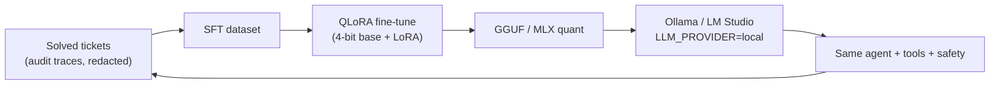

# Local-first inference & the QLoRA roadmap

**Goal:** run the whole copilot **without any cloud model** — so customer data never leaves the
network. For an MSP like techbold (1,200+ customers, 2,000+ servers), that data-sovereignty story is
as important as the troubleshooting itself.

---

## 1. What works today (no fine-tuning needed)

The LLM layer is provider-agnostic ([`app/llm.py`](../backend-py/app/llm.py) / [`src/llm.ts`](../backend-node/src/llm.ts)):

```bash
LLM_PROVIDER=local
LOCAL_BASE_URL=http://host.docker.internal:1234/v1   # LM Studio (or Ollama :11434/v1)
LOCAL_MODEL=qwen3-coder-30b-a3b-instruct             # 4-bit quantized (MLX)
```

The agent's tools, prompts, safety layer, and activity generation are **identical** across
providers, so switching to a quantized local model is a one-line change — **no app code touched**.
This already satisfies "we don't need the cloud model": an off-the-shelf quantized 30B runs the loop
locally. The cloud model (`gpt-5.4-nano`) stays as the default for raw accuracy; local is the
sovereignty / offline / zero-cost path.

**Honest trade-off:** a quantized general model is a bit weaker at strict tool-call formatting and
safety-contract adherence than a frontier model. The deterministic deny-list + human gate make that
*safe* regardless; QLoRA closes the *accuracy* gap.

---

## 2. The QLoRA roadmap (post-hackathon)

Fine-tune a **small, quantized** base into a task specialist that runs on a single on-prem GPU.

| Step | Plan |
|---|---|
| **Base** | Qwen2.5-Coder-7B / Llama-3.1-8B, loaded in **4-bit NF4** (bitsandbytes) |
| **Method** | **QLoRA** — frozen 4-bit base + trainable LoRA adapters (rank 16–32). Trains on one 24–48 GB GPU in hours, not days |
| **Dataset** | **Harvested from our own run traces** — every solved ticket's audit log (ticket → diagnostics → approved fix → validation → activity) is a supervised example, already redacted by the LLM guard. The product *generates its own training data* |
| **Objectives** | (1) exact `run_command`/`conclude` tool-call JSON, (2) **never** propose a deny-listed pattern, (3) persistence-aware fixes, (4) clean activity JSON |
| **Eval** | Replay held-out incidents on the **Docker fake-VM sandbox** (`sandbox/scenarios`) — score with the same rubric (root cause, fix, persists, no regression). Plus tool-call validity % and safety pass-rate |
| **Deploy** | Merge adapters → GGUF/MLX quant → serve via Ollama/LM Studio. The existing `LLM_PROVIDER=local` path serves it with **zero application change** |



**The closed loop:** more tickets → more training data → a better, smaller, fully-local model →
eventually no cloud dependency at all. The Docker sandbox doubles as the offline eval harness, so the
specialist can be validated against the exact rubric before it ever touches a customer system.

---

## 3. Why this is the right call for the hackathon

- **Demo "no cloud" now** with the quantized 30B (real, already wired) — flip `LLM_PROVIDER=local`.
- **Pitch QLoRA as the on-prem roadmap** — data never leaves the network, the product trains itself
  from its own audit trail, validated on the local sandbox. Engineering depth + a real MSP value-prop,
  without risking the freeze on an untrainable-in-time model.
